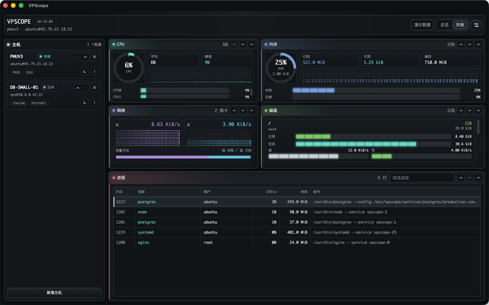
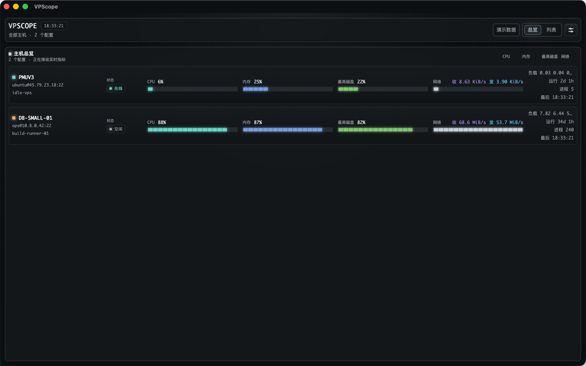

# VPScope

VPScope 是一个面向 macOS 的 VPS 监控桌面应用。它追求接近 `btop` 的信息密度、刷新速度和键盘效率，但产品形态是适合长期常驻的原生桌面应用，而不是终端界面的复刻。

项目使用 `Tauri v2 + Rust + React + TypeScript + Tailwind CSS` 构建。MVP 采用 agentless SSH：不要求在服务器安装 agent，由本地 Rust 后端通过 SSH 读取只读系统指标，再把结构化数据推送给前端展示。

## 截图



<p align="center">
  
  
</p>

## 项目定位

VPScope 面向需要长时间观察 VPS 状态的开发者和运维使用场景：

- 高密度、可扫视的监控界面，而不是营销型 dashboard。
- macOS-first，优先做好桌面常驻、主机切换、托盘状态和本地安全存储。
- agentless SSH，尽量复用已有 `~/.ssh/config`、SSH key 和 agent 工作流。
- 前后端边界清晰：前端负责 UI、状态和交互；Rust 后端负责 SSH、配置、凭据、解析、调度和事件流。
- 主题驱动设计：核心颜色、边框、状态色、图表色和密度规则来自 token，不在业务组件里硬编码。

MVP 明确不做破坏性远程操作，例如 kill、restart、delete、service control；也不把 Docker、Kubernetes、GPU、历史数据库或复杂告警系统作为当前范围。

## 当前能力

仓库当前是一个早期可用的桌面监控应用骨架，包含：

- 单主机 Dashboard：CPU、内存、磁盘、网络、负载、运行时间、进程和主机详情面板。
- 多主机 Overview：按主机快速扫视健康状态、CPU/内存/磁盘占用、网络吞吐和连接状态。
- 主机管理：主机配置、连接测试、连接状态、错误态和部分数据失败状态。
- 数据链路：通过 `/proc`、`df -P`、`ps` 等只读来源采集 Linux 指标。
- 桌面体验：Tauri 应用壳、托盘常驻、设置页、通知能力、主题切换和 macOS 构建流程。
- Mock 模式：前端可以脱离真实 Tauri/Rust 后端独立开发和预览。

常驻采集分为几个 profile：详情页使用较高频的 `active`，总览页使用 `overview`，窗口隐藏到托盘后使用更轻量的 `tray`。真正退出应用需要通过 Cmd+Q 或托盘菜单中的 Quit。

## 技术栈

- Desktop: `Tauri v2`
- Backend: `Rust`
- Frontend: `React 19 + TypeScript + Vite`
- Styling: `Tailwind CSS v4 + CSS variables`
- State: `Zustand`
- Virtualized list: `@tanstack/react-virtual`
- SSH: Rust 层通过 `openssh` 维护连接与采集

## 目录结构

```text
VPScope/
  docs/                 Product, role, contract, and verification docs
  web/                  React + TypeScript + Tailwind frontend
  src-tauri/            Tauri v2 Rust backend
  AGENTS.md             Coding-agent working contract
```

## 本地开发

### 环境要求

- macOS
- Node.js 20+
- `pnpm`
- Rust toolchain
- Tauri v2 build prerequisites

在仓库根目录安装依赖：

```bash
pnpm install
```

### 启动前端 Mock 模式

适合开发 UI、布局、主题、状态管理和 mock 数据。这个命令只启动 Vite，不需要 Tauri 运行时。

```bash
pnpm web:dev
```

前端开发服务器从 `web/` 启动，默认地址是 `127.0.0.1:1420`。

### 启动桌面应用

适合开发 Tauri 命令、Rust 后端、SSH 集成、托盘、通知和端到端桌面流程。

```bash
pnpm dev
```

### 验证改动

根据改动范围选择对应检查：

```bash
pnpm web:typecheck   # 前端 TypeScript 检查
pnpm web:build       # 前端生产构建
pnpm build           # Tauri 桌面应用构建
```

如果改动后端 parser 或数据转换逻辑，在 `src-tauri/` 中运行对应 Rust 测试，并设置 60 秒超时。

## 常用脚本

```bash
pnpm web:dev         # 启动前端 mock 开发服务器
pnpm web:typecheck   # 运行前端 TypeScript 检查
pnpm web:build       # 构建前端
pnpm dev             # 启动 Tauri 桌面应用
pnpm build           # 构建 Tauri 桌面应用
```

## 架构边界

```text
React UI
  -> frontend client abstraction
  -> Tauri commands / events
Rust app core
  -> host config / credentials / SSH / parsers / metrics scheduler
Remote VPS
  -> /proc + fixed read-only commands
```

重要边界：

- 前端组件不能直接 import Tauri API，必须通过 frontend client abstraction。
- SSH 和远程命令执行属于 Rust 后端，不属于前端。
- 前端不能传入任意 shell 命令字符串。
- 远程采集只使用固定的只读命令和 `/proc` 数据源。
- 敏感值不能存进普通 JSON/TOML 配置文件。
- 命令、事件、数据结构或错误码发生变化时，必须同步更新契约文档、前端类型、Rust serde 结构、mock 数据和测试。

## 文档入口

改产品行为、架构或前后端契约时，先看：

- [产品与架构计划](./docs/vpscope-plan.md)
- [前后端契约](./docs/roles/contracts.md)
- [角色分工与协作流程](./docs/roles/README.md)

按职责查实现说明：

- [前端实现说明](./docs/roles/frontend.md)
- [Rust 后端实现说明](./docs/roles/backend-rust.md)
- [联调与验证说明](./docs/roles/integration-test.md)
- [集成检查清单](./docs/roles/integration-checklist.md)

协作规则：

- [AGENTS.md](./AGENTS.md)

## 发布说明

本地开发构建可以使用 ad-hoc signing。面向普通用户分发时，需要使用 `Developer ID Application` 证书完成代码签名，并配置 Apple notarization，否则 Gatekeeper 可能拦截下载后的 `.app` 或 `.dmg`。

如果本机测试下载产物时遇到 Gatekeeper 阻拦，可以临时移除 quarantine 标记做开发验证：

```bash
xattr -dr com.apple.quarantine /Applications/VPScope.app
```

这只是开发绕过方式，公开 release 应以签名和公证后的产物为准。

## 参与贡献

提交较大改动前，建议先阅读 [AGENTS.md](./AGENTS.md) 和 [前后端契约](./docs/roles/contracts.md)。

如果改动涉及命令、事件、数据结构、错误码、mock 快照、parser 输出，或 UI 对后端数据的假设，请在同一个改动中同步更新契约、实现、mock 和测试。

## License

This project is licensed under the [MIT License](./LICENSE).
